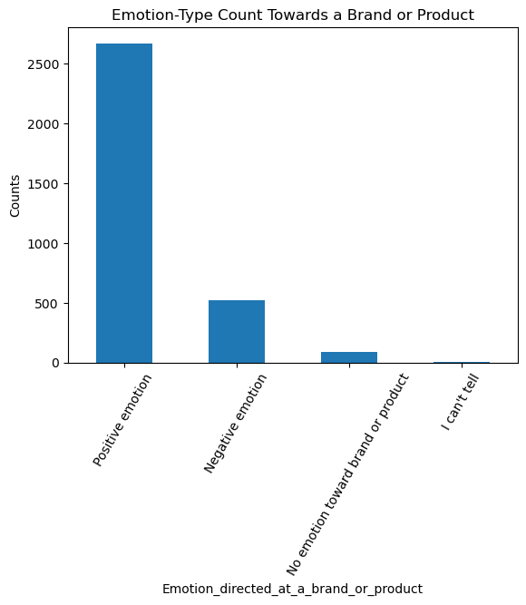
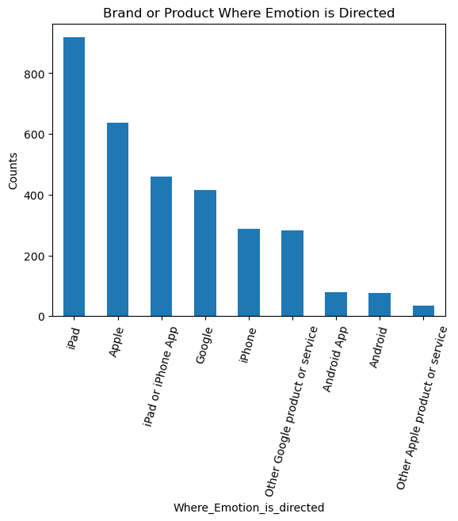
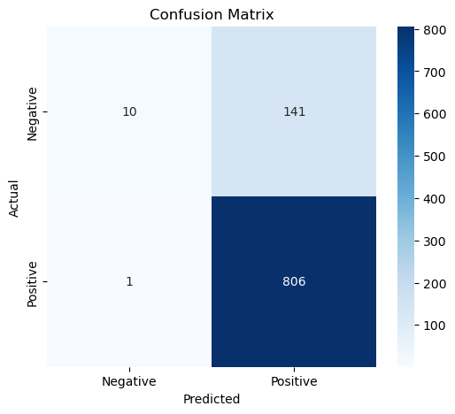
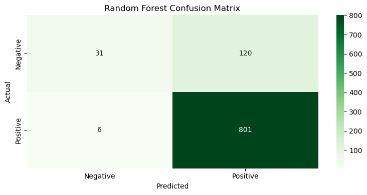

Phase IV Project
Reagan Adajo

Summary:
The project utilize two classification models to analyze the Tweets (Logistics Regression and Random Forest). The best Model will be determine for consequent adoption by the respective companies for automated sentiment rating

The outcomes of best-performing model will be used by the relevant companies to improve their brand, product, or service, among other decisions

Business and Data Understanding:
### Business Problem
The company wants to develop a model that will assist in judging people's emotions about brands and products using Tweets on Apple and Google products. 
### Business Aim
To build a model that judges customer's emotions on brands and products using their sentiments
### Business Objectives
1. To find out if a Tweet can demonstrate a sentiment on Apple and Google products
2. To identify the products with the most positive and negative sentiments
3. To establish the best classification model for analyzing sentiments on Twitter texts(automatically)

Data Understanding

The data was prepared by importing various python libraries along with various visualization to further explore and understand the data.

Modeling: A classification model was used on the data set to predict the where emotions were directed by the Tweets

The unique words were identified in the Tweets

Evaluation: The data was evaluated using Confusion Matrix. 
LogisticRegression
!
RandomForest

Random Forest with Accuracy an accuracy of 0.8684759916492694
Conclusions:
After performing EDA, preprocessing the text, and evaluating models, we conclude that Random Forest is the best with an accuracy 
of 0.8685.

## Recommendation and Insights
### Random Forest is the best classification model for Postiive and Negative emotions due to its his baseline accuracy scores
This implies that the actual verses predicted emotions in the tweets will be subject to higher accuracy in classification
### Actual and Predicted labels demonstrate alignment; 
This implies that there will be no confusion in the intwrpretation of the emotions
### The balanced color mapping highlights clear distinctions between positive and negative emotions
This depiction is useful in determining areas to be improved in the model but for this case it performs well

## Conclusion
 A single Tweet from Apple or Google can be use in predicting the emotions towards the product or brand. Classification models have high accuracy in predicting the emotions from a tweet text
 Possible errors in LogisticRegression Model can be reduced further by implementing the RandomForest Model
 Tweet_texts are useful in identifying a problem with a product or brand from either Google or Apple, this informs on areas for improvement.
