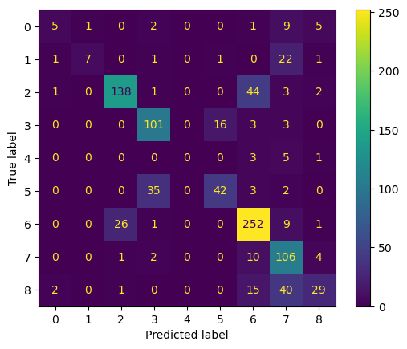

Phase IV Project
Reagan Adajo

Summary:

Business and Data Understanding:
### Business Problem
The company wants to develop a model that will assist in judging people's emotions about brands and products using Tweets on Apple and Google products. 
### Business Aim
To build a model that judges customer's emotions on brands and products using their sentiments
### Business Objectives
1. To find out the overall sentiments on Apple and Google products
2. To identify the products with the most positive and negative sentiments
3. To establish how the negative sentiments would be improved 
Data Understanding
Different data source files were viewed and the right one for the EDA selected
Json file Description:
{'name': 'crowdflower_brands-and-product-emotions', 'title': 'Brands and Product Emotions', 'description': 'Judge Emotion About Brands and Products\n\nContributors evaluated tweets about multiple brands and products. The crowd was asked if the tweet expressed positive, negative, or no emotion towards a brand and/or product. If some emotion was expressed they were also asked to say which brand or product was the target of that emotion.   Added: August 30, 2013 by Kent Cavender-Bares | Data Rows: 9093 Download Now\n\nSource: https://www.crowdflower.com/data-for-everyone/', 'homepage': 'https://data.world/crowdflower/brands-and-product-emotions', 'license': 'Public Domain', 'resources': [{'name': 'judge_1377884607_tweet_product_company', 'schema': {'fields': [{'name': 'tweet_text', 'title': 'tweet_text', 'type': 'string', 'rdfType': 'http://www.w3.org/2001/XMLSchema#string', 'dwSourceId': 'tweet_text'}, {'name': 'emotion_in_tweet_is_directed_at', 'title': 'emotion_in_tweet_is_directed_at', 'type': 'string', 'rdfType': 'http://www.w3.org/2001/XMLSchema#string', 'dwSourceId': 'emotion_in_tweet_is_directed_at'}, {'name': 'is_there_an_emotion_directed_at_a_brand_or_product', 'title': 'is_there_an_emotion_directed_at_a_brand_or_product', 'type': 'string', 'rdfType': 'http://www.w3.org/2001/XMLSchema#string', 'dwSourceId': 'is_there_an_emotion_directed_at_a_brand_or_product'}]}, 'path': 'data/judge_1377884607_tweet_product_company.csv', 'format': 'csv'}, {'name': 'original/judge-1377884607_tweet_product_company.csv', 'path': 'original/judge-1377884607_tweet_product_company.csv', 'format': 'csv', 'mediatype': 'text/csv', 'bytes': 1260464}], 'keywords': ['crowdsourced', 'emotions', 'twitter', 'sentiment', 'brands', 'products']}

The data was prepared by importing various python libraries along with various visualization to further explore and understand the data.

Modeling: A classification model was used on the data set to predict the where emotions were directed by the Tweets

Evaluation: The data was evaluated using Confusion Matrix. 

## Recommendation and Insights
1. The color orientation in the Confusion Matrix visualizes poor performance of the classification model. 
This implies that the actual verses predicted emotions in the tweets will be subject to misclassification.
2. The True and Predicted labels demonstrate a misalignment;
This implies that there will be a confusion in the results-interpretation from the model. 
3. The imbalance color mapping highlights areas with problems in the model;
This depiction is useful in determining areas that needs to be improved in the model

## Conclusion
1. A single tweet from Apple or Google cannot be use in predicting the emotions towards the product or brand.
2. Classification model has low accuracy and increased errors in predicting the emotions from a tweet text.
3. Tweet_texts are useful in identifying a problem with a product or brand from either Google or Apple, this informs on areas for improvement. 
